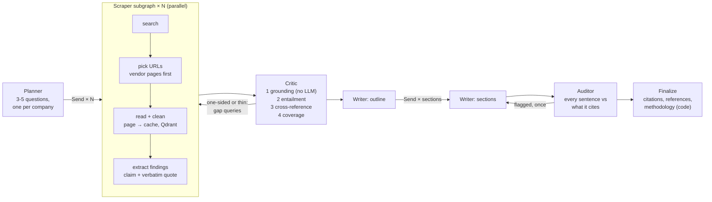

# Deep Research Agents

[](https://github.com/tankaihooi/agentic-research-pipeline/actions/workflows/ci.yml)

**One prompt → five agents → a multi-page, cited briefing where every claim has been checked
against its source.**

Ask *"Give me a competitive analysis of Stripe's new billing features"*. Over about four minutes
a **Planner** splits the request into research questions, parallel **Scrapers** read around 35
web pages, a **Critic** rejects any claim its source does not support and sends the scrapers
back when evidence is one-sided, a **Writer** drafts the sections in parallel, and an
**Auditor** checks every sentence against what it cites.

https://github.com/user-attachments/assets/b7ff282d-2880-468d-acf5-ee358b3fb11f

*A real run of the Stripe prompt, replayed from its event log at 4× with waits over 3 s trimmed.
Nothing is staged or re-run. [How it was recorded](docs/video.md).*

- 🔎 **Public execution trace (LangSmith):** [the Stripe run, 409 spans](https://apac.smith.langchain.com/public/858a553f-9f6d-41df-b540-9fc6e62264aa/r) · [timeline and per-agent breakdown](docs/trace.md)
- 📄 **Example report:** [Stripe billing competitive analysis](examples/stripe-billing/report.md) (3,702 words, 29 cited sources)

## Results

Measured on three frozen real runs with planted fabrications
([method, full tables, caveats](evals/results/RESULTS.md)):

| Metric | Result |
|---|---|
| Planted fabrications the Critic catches | **97%** (range 97-98% over 3 repeats, 116 plants) |
| Genuine findings it wrongly rejects | **3%** (range 3-4%) |
| Invented quotes caught with **no LLM call** (deterministic grounding) | 30 / 30 |
| Plants cited in the final report, Critic off → on | **4 → 0** |
| Unsupported / not-fully-supported statements, Critic off → on | 1% → 0% / 9% → 5% |
| Raw web text → verified evidence reaching the Writer | 250k-650k → 12k-18k tokens (**14-38× smaller**) |
| A standard run | 4-6 min · $0.28-0.36 · 33-35 sources · 3,000-4,100 words |

## How it works



| Agent | Model tier | Job |
|---|---|---|
| **Planner** | strong | Break the request into specific questions and list the official domains of every company covered. |
| **Scraper** (subgraph, one per question) | fast | Tavily search, vendor-first URL selection, page cleaning, Qdrant indexing, extraction of atomic findings, each with a verbatim quote. |
| **Critic** | fast | Grounding (the quote must be on the page), entailment (the quote must support the claim, read with the headings above it), cross-reference (other sources corroborate or contradict), coverage (volume and site diversity) with a bounded gap loop. |
| **Writer** | strong | Outline, parallel section drafts that each see only their own findings, executive summary, numbered citations. |
| **Auditor** | fast | Checks each statement against the findings it cites. One revision round; anything still flagged is marked † in the report. |

The real run, from its LangSmith trace ([details](docs/trace.md)). Overlapping bars ran
concurrently:

```mermaid
gantt
    dateFormat HH:mm:ss
    axisFormat %M:%S
    section Plan
    planner :n0, 00:00:00, 00:00:11
    section Research
    research :n1, 00:00:11, 00:00:38
    research :n2, 00:00:11, 00:00:30
    research :n3, 00:00:11, 00:00:36
    research :n4, 00:00:11, 00:00:41
    research :n5, 00:00:11, 00:00:45
    join research :n6, 00:00:45, 00:00:46
    section Verify
    critic verify :n7, 00:00:45, 00:01:06
    critic assess :n8, 00:01:06, 00:01:12
    section Research (gap loop)
    research :n9, 00:01:12, 00:01:34
    research :n10, 00:01:12, 00:01:27
    research :n11, 00:01:12, 00:01:42
    research :n12, 00:01:12, 00:01:48
    join research :n13, 00:01:48, 00:01:49
    section Verify (gap loop)
    critic verify :n14, 00:01:48, 00:02:38
    critic assess :n15, 00:02:38, 00:02:39
    section Write
    writer outline :n16, 00:02:38, 00:03:01
    write section :n17, 00:03:01, 00:03:13
    write section :n18, 00:03:01, 00:03:15
    write section :n19, 00:03:01, 00:03:12
    write section :n20, 00:03:01, 00:03:13
    write section :n21, 00:03:01, 00:03:12
    write section :n22, 00:03:01, 00:03:13
    write section :n23, 00:03:01, 00:03:27
    section Audit
    audit sections :n24, 00:03:27, 00:03:36
    revise section :n25, 00:03:36, 00:03:43
    revise section :n26, 00:03:36, 00:03:44
    revise section :n27, 00:03:36, 00:03:43
    revise section :n28, 00:03:36, 00:03:48
    audit sections :n29, 00:03:48, 00:03:58
    section Finalize
    finalize :n30, 00:03:58, 00:04:06
```



## Engineering highlights

**Long-running, fault-tolerant orchestration (LangGraph)**
- `Send` fan-out: one scraper subgraph per question, one writer per section, one revision per
  flagged section. A bounded cycle runs Critic → gap queries → Scrapers.
- A SQLite checkpoint after every step (`durability="sync"`, allow-listed deserialisation).
  `research resume <id>` continues after a crash, even inside subgraphs.
  `research rewrite <id>` forks the thread before the Writer and regenerates only the report.
- Time and cost budgets per depth preset. When the budget runs short, the router stops
  gap-filling and writes with what has been verified, and says so in the report.
- Concurrency caps per resource, SDK and tenacity retries, and per-page error isolation.
  Dependencies are injected through a typed LangGraph runtime context.

**Context-window management.** Raw page text never enters graph state. It is cleaned (menus and
footers stripped: 13-40% fewer tokens per run, up to 80% on menu-heavy marketing pages), cached
on disk, and chunked into Qdrant. State carries only pointers and quote-backed findings. Each
section writer sees 1.2-3.7k tokens of its own evidence (median 1.7k), so a 3,700-word report
never needs a large prompt. Every run records the funnel in
`metrics.json`.

**Verification in depth.** Checks run cheapest first: deterministic quote grounding, then an
LLM judge that sees the heading trail (dates on a changelog live in headings), then cross-source
corroboration and contradiction. Coverage measures site diversity as well as volume: vendor docs
alone are authoritative but one-sided. The Methodology & limitations section is generated from
run state in code, so its numbers are exact.

**Observability.** LangSmith traces every node, tool and retriever span. Each LLM call is
tagged with its agent and tier, so tokens and latency are attributed per agent. Independently of
LangSmith, every run writes `metrics.json` (per-agent tokens and cost) and `events.jsonl` (the
narrated log behind the live dashboard and `research replay`).

**Evaluation.** Frozen fixtures of evidence windows (not page copies), four kinds of planted
fabrication, reference labels from a stronger model, an ablation that reruns the real graph's
writing stage with the Critic on and off, and LangSmith experiments for side-by-side comparison.
Building the eval surfaced a real grounding bug (a truncated markdown link swallowed text), now
fixed with a regression test.

**Quality.** 92 offline tests (fake LLM and search, in-memory Qdrant, the real graph end to end,
crash-and-resume), ruff, pyright, and GitHub Actions CI.

## Examples

Each folder has the report, the event log (replayable), metrics and sources.

| Prompt | Report | Run |
|---|---|---|
| Give me a competitive analysis of Stripe's new billing features | [3,702 words, 29 sources](examples/stripe-billing/report.md) | 246s · $0.29 · 258 findings, 27 rejected |
| Compare the leading vector databases for production RAG in 2026 (Pinecone, Qdrant, Weaviate, pgvector) | [4,099 words, 32 sources](examples/vector-databases/report.md) | 364s · $0.36 · 289 findings, 16 contradicted |
| What obligations does the EU AI Act place on providers of general-purpose AI models, and what is the compliance timeline through 2027? | [3,080 words, 30 sources](examples/eu-ai-act-gpai/report.md) | 248s · $0.28 · 237 findings, 10 rejected |

```bash
uv run research replay examples/stripe-billing --speed 8   # watch it as a time-lapse
uv run research show examples/stripe-billing               # read it in the terminal
```

## Quickstart

```bash
git clone https://github.com/tankaihooi/agentic-research-pipeline.git
cd agentic-research-pipeline
uv sync
cp .env.example .env    # OPENAI_API_KEY, TAVILY_API_KEY, LANGSMITH_API_KEY (+ LANGSMITH_ENDPOINT if not US)
uv run research doctor  # checks keys and makes one traced call
uv run research run "Give me a competitive analysis of Stripe's new billing features"
```

| Command | What it does |
|---|---|
| `research run "<prompt>" --depth quick\|standard\|deep` | Research and write a report (live dashboard; `--plain` for logs). |
| `research resume <run_id>` | Continue an interrupted run from its checkpoint. |
| `research rewrite <run_id>` | Regenerate only the report from the stored research. |
| `research replay <run_id or folder> --speed 8` | Re-render a recorded run. |
| `research show <run_id or folder>` | Render a report in the terminal. |
| `python -m evals.run_all all --langsmith` | Run the evaluation (about $2.50) and write `evals/results/RESULTS.md`. |

Stack: Python 3.12, LangGraph, OpenAI (Responses API with structured outputs; `gpt-6-luna` /
`gpt-6-sol`, `text-embedding-3-small`), LangSmith, Tavily, Qdrant, Rich, Pydantic v2, uv.

## Project layout

```
src/deep_research/
  agents/        planner, extractor, critic, writer, auditor
  graph/         state + reducers, main workflow, scraper subgraph, checkpointing
  tools/         search (Tavily), fetch (httpx + trafilatura), text (cleaning, grounding, citations)
  memory/        Qdrant vector store, page cache
  ui/            live dashboard, replay
  llm.py         traced OpenAI wrapper with per-agent usage and cost
  runner.py      run / resume / rewrite, events → dashboard, artefacts
evals/           fixtures, plants, reference labels, critic eval, ablation, LangSmith logging
examples/        three real runs
docs/            architecture.md (design and trade-offs), trace.md, video.md
tests/           offline test suite
```

## Limitations and next steps

- **Evaluation scale.** The plants are synthetic and the reference labels are model-made. A
  human-labelled set and more topics would strengthen the numbers.
- **The Critic can be strict about scope.** Most of its false rejections are defensible
  narrow readings, and entity-swap plants are weak on regulatory text.
- **Web sources are as retrieved.** Pricing changes often and vendor pages are favourable to
  themselves. Reports mark single-source and contradicted claims, and † marks statements still
  flagged after revision.
- **Next:** reuse findings from past runs (the vector store already persists pages across runs),
  add a web dashboard over the same event stream, and add PDF ingestion.

Design decisions, trade-offs and what live runs revealed: [docs/architecture.md](docs/architecture.md).
