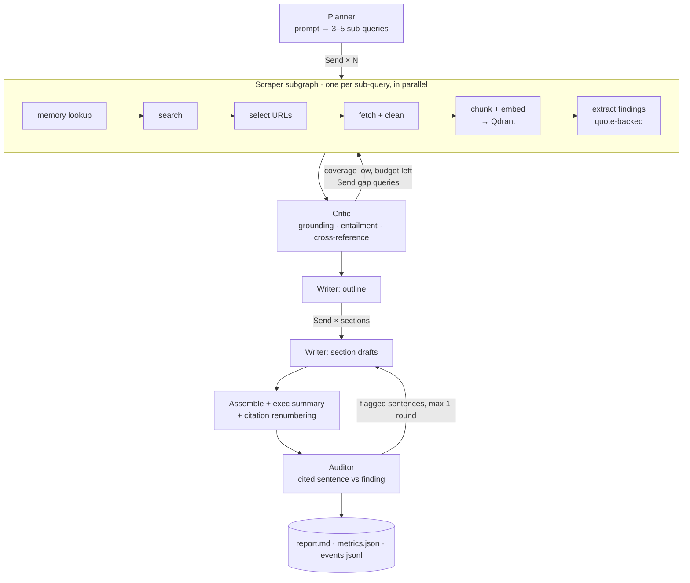

# Architecture

This document explains how the system works and why it is built this way. It is written for a
technical reviewer. The README has the quickstart and results.

## Problem

Given a broad prompt such as *"Give me a competitive analysis of Stripe's new billing features"*,
research the live web for several minutes and produce a multi-page Markdown report in which every
claim is cited and has actually been checked against its source.

Two things make this hard:

1. **Volume against context.** A single run reads 25–60 pages (roughly 200k–500k tokens of raw
   text). No single prompt should hold all of it, and summarising naively loses the specific facts
   (prices, dates, feature names) a competitive analysis depends on.
2. **Hallucination.** Language models invent plausible features and misquote numbers. A report that
   *looks* cited but isn't grounded is worse than no report.

## Pipeline

Every box is a LangGraph node. `Send` produces the parallel branches, and state reducers merge
their outputs.

## State and what flows between agents

State is a `TypedDict` with reducers (`graph/state.py`). The entities in it are Pydantic models
(`models.py`):

| Payload | Produced by | Consumed by | Contains |
|---|---|---|---|
| `SubQuery` | Planner, Critic (gap queries) | Scraper | question, search terms, rationale |
| `Source` | Scraper | Critic, Writer | url, title, domain, `is_primary`, token count, **path** to text |
| `Finding` | Scraper (extract step) | Critic, Writer | one atomic claim, a **verbatim quote**, source id |
| `Verdict` | Critic | Writer | verified / single-source / contradicted / rejected, with reasons |
| `Section` | Writer | Auditor, assembler | markdown with `[S-xxxx]` citation markers |
| `Usage` | every agent | router, metrics | per-agent tokens, latency, cost |

Ids are deterministic hashes (`stable_id`), and list channels merge with `upsert_by_id`. A
retried node, a duplicate parallel branch, or a resumed run therefore overwrites instead of
duplicating.

## Context-window strategy

1. **Boilerplate is removed first.** Search APIs return whole pages, and on marketing sites
   navigation mega-menus are about half the markdown. `clean_page_markdown` drops link-dominated
   lines and trims to the prose window. On six live Stripe-related pages it cut 49.5k tokens to
   15.0k (70%) while keeping the article text, which makes every later step cheaper and keeps
   menu chunks out of retrieval.
2. **Raw text stays out of state.** Page text is written to `runs/<id>/sources/<hash>.md` and
   chunked into Qdrant. State holds only a pointer.
3. **The map step compresses with provenance.** Each page gets one extraction call that returns
   atomic findings, each tied to a verbatim quote. About 8k tokens of page become about 300 tokens
   of findings. Nothing is paraphrased away without a quote to check it against.
4. **Retrieval instead of stuffing.** The Critic pulls only the top-k chunks relevant to a claim
   from *other* sources.
5. **Scoped writing.** Each section writer sees only its assigned verified findings plus a short
   run brief. The report can be long while every prompt stays small.
6. **Measured.** `metrics.json` records raw scraped tokens against tokens delivered to the Writer.

## The Critic

The checks run from cheapest to most expensive:

1. **Grounding (deterministic, no LLM).** The quote must fuzzy-match the stored source text
   (rapidfuzz). This catches quotes the extractor invented.
2. **Entailment (fast model, batched per source).** Does the quote actually support the claim?
   This catches distorted numbers, dates and scope.
3. **Cross-reference (vector retrieval + fast model).** Do other sources corroborate or
   contradict the claim? Primary sources (the vendor's own domain) count as authoritative for
   first-party facts.
4. **Coverage.** Sub-queries with too few verified findings produce gap queries. If loops and
   budget remain, the router sends them back to the Scraper.

Rejected findings never reach the Writer. The count and the reasons appear in the report's
Methodology & Limitations section.

## Long-running execution

- **Concurrency limits:** separate semaphores for search, fetch and LLM calls (`config.py`).
- **Retries:** the OpenAI SDK retries 429/5xx responses with backoff, tenacity retries Tavily and
  fetch calls, and network nodes also get a LangGraph `RetryPolicy`.
- **Failure isolation:** a failed page becomes a `RunError` in state, not a crashed run.
- **Budgets:** each depth preset sets a wall-clock deadline and a cost cap. Once either is hit, the
  router stops gap-filling and writes with what has been verified, and the report says so.
- **Checkpointing:** `AsyncSqliteSaver` persists state after every step with
  `durability="sync"`, so a crash can't lose a step that finished. `research resume <run_id>`
  continues from the checkpoint. Subgraphs are checkpointed too: in a live test, a Ctrl-C during
  page reading resumed each scraper branch at its own interrupted step, without repeating searches
  that had already finished. The serializer only revives an explicit allowlist of our own types.

## Observability

- LangGraph nodes are traced to LangSmith automatically. OpenAI calls go through `wrap_openai`, so
  each LLM span carries its token usage, and every call is tagged with its agent and model tier.
- Search, fetch and retrieval are traced as `tool` and `retriever` spans.
- The root run carries `run_id`, prompt, depth and model ids as metadata.
- Independently of LangSmith, every run writes `metrics.json` (per-agent tokens, cost and
  latency) and `events.jsonl` (the narrated agent log used by the terminal UI and replay).

## Key decisions and trade-offs

| Decision | Why | Trade-off accepted |
|---|---|---|
| LangGraph over a hand-rolled state machine | `Send` fan-out, subgraphs, checkpointing and tracing come built in, so the effort goes into agent quality | framework coupling |
| `TypedDict` state + Pydantic entities | idiomatic reducers, no per-update model re-validation | two type systems to keep aligned |
| Raw OpenAI SDK instead of langchain-openai | explicit payloads, Responses API structured outputs, thin dependency surface | we write our own usage accounting |
| Deterministic grounding before any LLM judge | cheap, exact and explainable; catches the most common extraction failure | fuzzy-match threshold needs tuning |
| Qdrant in embedded mode | no Docker or infrastructure for reviewers; same client API as Qdrant Cloud | single-process access to the local store |
| Tavily plus a trafilatura fallback | search and clean extraction in one API; fallback for pages Tavily cannot extract | third-party dependency and credit limits |
| LangSmith region via `LANGSMITH_ENDPOINT` | keys are region-bound (US/EU/APAC); `research doctor` makes an authenticated call so a mismatch fails up front instead of silently dropping traces | one more env var |
| Official-source preference in URL selection | search relevance is not authority; vendor docs, pricing and changelogs outrank SEO listicles (a live run went from 2/9 to 7/9 primary sources after this and per-company planning) | fewer independent third-party views per question |
| Two model tiers | high-volume calls (extraction, critique) on the cheap tier, synthesis on the strong tier | two models to evaluate |

## Build phases

0. Scaffold: config, models, state, LLM wrapper, events, tracing, CI.
1. Tools and memory: search, fetch, text utilities, Qdrant store.
2. Planner + Scraper subgraph + workflow skeleton + checkpoint/resume.
3. Critic + gap loop + budget routing.
4. Writer + auditor.
5. Terminal UI + replay.
6. Evaluation: fabrication catch rate, with/without-Critic ablation, compression.
7. Packaging: examples, README, video, public trace.
