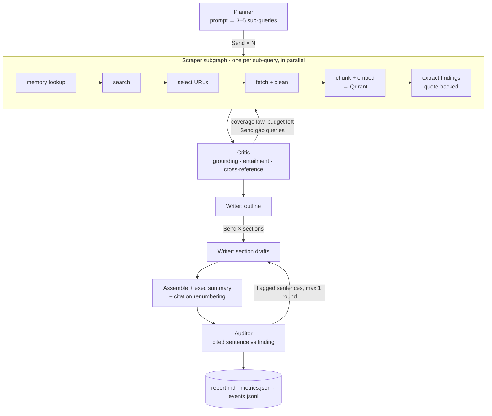
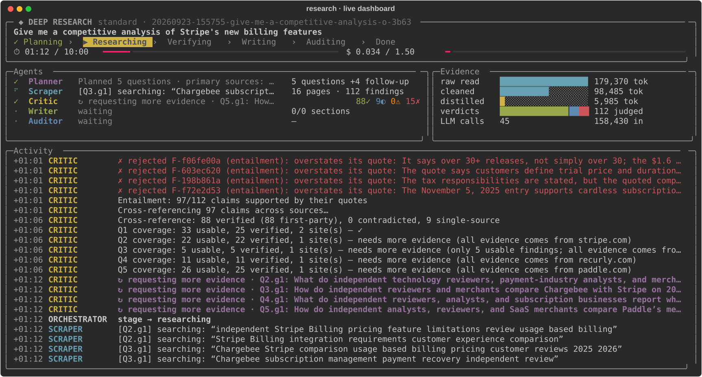

# Architecture

This document explains how the system works and why it is built this way. It is written for a
technical reviewer. The README has the quickstart and results.

## Problem

Given a broad prompt such as *"Give me a competitive analysis of Stripe's new billing features"*,
research the live web for several minutes and produce a multi-page Markdown report in which every
claim is cited and has actually been checked against its source.

Two things make this hard:

1. **Volume against context.** A single run reads 25–60 pages (roughly 200k–500k tokens of raw
   text). No single prompt should hold all of it, and summarising naively loses the specific facts
   (prices, dates, feature names) a competitive analysis depends on.
2. **Hallucination.** Language models invent plausible features and misquote numbers. A report that
   *looks* cited but isn't grounded is worse than no report.

## Pipeline

Every box is a LangGraph node. `Send` produces the parallel branches, and state reducers merge
their outputs.

## State and what flows between agents

State is a `TypedDict` with reducers (`graph/state.py`). The entities in it are Pydantic models
(`models.py`):

| Payload | Produced by | Consumed by | Contains |
|---|---|---|---|
| `SubQuery` | Planner, Critic (gap queries) | Scraper | question, search terms, rationale |
| `Source` | Scraper | Critic, Writer | url, title, domain, `is_primary`, token count, **path** to text |
| `Finding` | Scraper (extract step) | Critic, Writer | one atomic claim, a **verbatim quote**, source id |
| `Verdict` | Critic | Writer | verified / single-source / contradicted / rejected, with reasons |
| `Section` | Writer | Auditor, assembler | markdown with `[S-xxxx]` citation markers |
| `Usage` | every agent | router, metrics | per-agent tokens, latency, cost |

Ids are deterministic hashes (`stable_id`), and list channels merge with `upsert_by_id`. A
retried node, a duplicate parallel branch, or a resumed run therefore overwrites instead of
duplicating.

## Context-window strategy

1. **Boilerplate is removed first.** Search APIs return whole pages, and on marketing sites
   navigation mega-menus are about half the markdown. `clean_page_markdown` drops link-dominated
   lines and trims to the prose window. On six live Stripe-related pages it cut 49.5k tokens to
   15.0k (70%) while keeping the article text, which makes every later step cheaper and keeps
   menu chunks out of retrieval.
2. **Raw text stays out of state.** Page text is written to `runs/<id>/sources/<hash>.md` and
   chunked into Qdrant. State holds only a pointer.
3. **The map step compresses with provenance.** Each page gets one extraction call that returns
   atomic findings, each tied to a verbatim quote. About 8k tokens of page become about 300 tokens
   of findings. Nothing is paraphrased away without a quote to check it against.
4. **Retrieval instead of stuffing.** The Critic pulls only the top-k chunks relevant to a claim
   from *other* sources.
5. **Scoped writing.** Each section writer sees only its assigned verified findings plus a short
   run brief. The report can be long while every prompt stays small.
6. **Measured.** `metrics.json` records raw scraped tokens against tokens delivered to the Writer.

## The Critic

The checks run from cheapest to most expensive, and each sees only what survived the one before
(`agents/critic.py`):

1. **Grounding (deterministic, no LLM).** The quote must fuzzy-match the stored source text
   (rapidfuzz, threshold 85; short quotes must match exactly). This catches quotes the extractor
   invented.
2. **Entailment (fast model, batched per source).** Does the quote support the claim? The judge
   sees the quote, about 500 characters around it, the page title, and the **heading trail**
   above the quote (e.g. `Changelog > 2026-05-27 > Billing`). This catches changed numbers,
   overreach, and claims credited to the wrong product or company.
3. **Cross-reference (vector retrieval + fast model).** Claims are embedded in one batch, and
   each retrieves the top chunks from *other* sources in the run. The judge marks each claim
   corroborated, contradicted or no evidence, and may only cite sources it was shown. Facts a
   vendor states about itself on its own domain are accepted as first-party without
   corroboration.
4. **Coverage.** A question is weak if it has too few verified findings, too few usable
   findings, or evidence from only one site. Weak questions get one gap query each, targeted at
   the stated weakness. A one-sided question gets a query that avoids the dominant site. Gap
   loops are bounded by the depth preset and only start while at least half the time and cost
   budget remains.

Verdicts: `verified`, `single_source` (kept, reported with hedged wording), `contradicted` (kept,
with the disagreement surfaced), and `rejected` (never reaches the Writer; counts and reasons
go to Methodology & Limitations).

**What live runs showed** (standard depth, Stripe competitive-analysis prompt):

- Grounding passed 117/117 and 73/73 real quotes. Its value shows up against fabrications,
  which the Phase 6 evaluation plants deliberately.
- Entailment first rejected 37 of 177 claims. An audit found most rejections were missing
  context: on changelogs the release date is a heading far above the quoted bullet. After
  adding the heading trail, re-judging those 37 accepted 26. The 11 still rejected were real
  errors: a feature dated September 2025 that the page dates June 2025; Pix/UPI/Twint recurring
  payments (Stripe *Payments* entries) credited to Billing; and a reversed attribution of
  Stripe's 0.70% rate to Chargebee.
- Cross-reference contradictions were genuine disagreements between third-party sources, for
  example Stripe's Metronome acquisition dated December 2025 by one source and January 2026 by
  another, and "40+ gateways" against "35+ processors" for Chargebee.
- The first pass is dominated by vendor documentation (100 of 111 verified findings were
  first-party). The diversity check flagged those questions as one-sided, and the gap loop
  brought in Forrester, Gartner coverage, Orb, Lago, Trustpilot and Reddit. A standard run
  took about 105s and $0.05.

## The Writer and the auditor

- **Outline (strong tier).** Sees one line per usable finding (id, entity, category, status,
  claim; no quotes) and assigns findings to 4-7 sections. Unknown ids and empty sections are
  dropped in code.
- **Sections in parallel (`Send`, strong tier).** Each writer sees only its own findings, now
  with quote, source and verification status, plus the brief and the other section titles.
  Status drives wording: first-party claims are attributed to the vendor, single-source claims
  to their site, and contradictions are stated as disagreements. Every factual sentence cites
  finding ids (`[F-1a2b3c4d]`). In the live run each writer received 0.7k-1.8k tokens of
  evidence, so a ~3,000-word report never needs a large prompt.
- **Sentence audit (fast tier).** Each section is split into statements (sentences, list items,
  table rows). Two checks are deterministic: a figure without a citation, and a citation to an
  unknown id. The rest go to a judge that sees each statement next to its cited findings'
  claims, quotes and source sites, and marks it supported, overstated or unsupported. Flagged
  sections get one revision round and are re-audited. Anything still flagged is marked † in the
  report rather than silently kept or dropped.
- **Finalize.** Executive summary bullets may only cite ids the body cites. Finding ids are
  renumbered to source references in order of first citation, citations are moved inside their
  sentence, and a linter checks that every `[n]` resolves and every reference is cited.
  **Methodology & limitations is generated in code from run state,** so every count in it is
  exact.
- **`research rewrite <run_id>`** forks the run's LangGraph thread from the checkpoint just
  before `writer_outline` and re-runs only the writing stage on the stored research. The
  previous report is archived. This made writer iterations cost about $0.18 instead of a full
  run.

**What live runs showed:** the first outline prompt used only 58 of 199 usable findings (18
cited sources). Asking for most relevant evidence raised that to 94 findings and 24 sources
(3,136 words, 7 sections). The first auditor lacked source information and falsely flagged
attributions ("according to paddle.com"). With source sites shown, re-auditing the same report
flagged 2 of 82 statements, both genuine nuances.

## Evaluation

`evals/` measures the Critic, and what it changes in the final report, on three frozen fixtures
from real standard runs: Stripe billing, vector databases, and EU AI Act obligations. Full
tables and caveats are in [evals/results/RESULTS.md](../evals/results/RESULTS.md).

- **Fixtures** keep the run's sources, findings and verdicts, plus *evidence windows* (page
  title plus about ±1,500 characters around each quote, with the heading trail) rather than
  full page copies. All 214/214 and 288/289 real quotes still ground against the windows. The
  one miss was also rejected by grounding in the live run.
- **Planted fabrications:** 30 each of an invented quote, an invented claim with a real quote,
  a distorted number or date, and a wrong company (26 valid). The reference judge confirmed 116
  of 120 as false; the rest are excluded.
- **Critic** (3 repeats): **97% of plants caught (range 97-98%), 3% of genuine findings wrongly
  rejected (range 3-4%).** Grounding alone catches every invented quote (26% of plants) with
  no LLM call, and entailment takes the rest to 98%. The misses are one distorted date, which
  cross-reference still flagged as contradicted, and weak company swaps on regulatory text.
- **Ablation** (same evidence, Critic off vs on, pooled): plants reaching the Writer
  116 → 1, plants cited in the final report 4 → 0, unsupported statements 1% → 0%, not fully
  supported 9% → 5%, judged by the strong model against source text. The per-layer funnel shows
  the sentence auditor does not stop fabricated findings (every plant the outline picked
  reached the report), because a fabricated finding supports its own sentence. The Critic is
  the layer that stops them.
- **LangSmith:** the results are also datasets with experiments: `critic-grounding-only` vs
  `critic-grounding+entailment` vs `critic-full`, and `ablation-critic-off` vs
  `ablation-critic-on`, for side-by-side comparison.
- **A bug found on the way:** building fixtures exposed a bug in the grounding normaliser. A
  truncated markdown link (`](https://...` with no closing parenthesis) swallowed everything up
  to the next `)`, which could make the live Critic reject genuine quotes. Link targets are now
  matched without whitespace, with a regression test.

## Long-running execution

- **Concurrency limits:** separate semaphores for search, fetch and LLM calls (`config.py`).
- **Retries:** the OpenAI SDK retries 429/5xx responses with backoff, tenacity retries Tavily and
  fetch calls, and network nodes also get a LangGraph `RetryPolicy`.
- **Failure isolation:** a failed page becomes a `RunError` in state, not a crashed run.
- **Budgets:** each depth preset sets a wall-clock deadline and a cost cap. Once either is hit, the
  router stops gap-filling and writes with what has been verified, and the report says so.
- **Checkpointing:** `AsyncSqliteSaver` persists state after every step with
  `durability="sync"`, so a crash can't lose a step that finished. `research resume <run_id>`
  continues from the checkpoint. Subgraphs are checkpointed too: in a live test, a Ctrl-C during
  page reading resumed each scraper branch at its own interrupted step, without repeating searches
  that had already finished. The serializer only revives an explicit allowlist of our own types.

## Observability

- LangGraph nodes are traced to LangSmith automatically. OpenAI calls go through `wrap_openai`, so
  each LLM span carries its token usage, and every call is tagged with its agent and model tier.
- Search, fetch and retrieval are traced as `tool` and `retriever` spans.
- The root run carries `run_id`, prompt, depth and model ids as metadata.
- Independently of LangSmith, every run writes `metrics.json` (per-agent tokens, cost and
  latency) and `events.jsonl` (the narrated agent log used by the terminal UI and replay).

## Terminal dashboard and replay

- Every agent narrates through `emit(...)`, which writes LangGraph custom-stream events. The
  runner also turns top-level `updates` into two synthetic event kinds: `stage` (pipeline
  position) and `usage` (running cost and tokens). Only top-level updates count: a scraper
  branch's usage arrives once, in the parent `research` node's update, so counting subgraph
  updates too would double it.
- `DashboardState` folds events into counters (pure and unit-tested), and `Dashboard` renders
  it with Rich: pipeline stages, time and cost budget bars, one row per agent with current
  activity and counters, a token funnel, a verdict bar, and a colour-coded activity log.
- Redraws come from an asyncio ticker on the same event loop that applies events, with Rich's
  auto-refresh off, so no background thread reads state while it changes.
- A node's `stage` update lands only when the node finishes, so the pipeline marker also follows
  each agent's own events. Otherwise the screen would say "Writing" while the Auditor is visibly
  flagging.
- `research replay <run_id> --speed 8` plays `events.jsonl` back through the same dashboard on
  a virtual clock, capping long pauses. A 110-second run replays in about 15 seconds. This is
  how the time-lapse video is filmed: from a real run's log, without paying for another run.
  `research show <run_id>` renders the report for the closing shot. `scripts/render_frame.py`
  renders any moment of a run to SVG (this page's screenshot is a real frame).
- Non-TTY output (pipes, CI) and `--plain` fall back to one line per event.

## Key decisions and trade-offs

| Decision | Why | Trade-off accepted |
|---|---|---|
| LangGraph over a hand-rolled state machine | `Send` fan-out, subgraphs, checkpointing and tracing come built in, so the effort goes into agent quality | framework coupling |
| `TypedDict` state + Pydantic entities | idiomatic reducers, no per-update model re-validation | two type systems to keep aligned |
| Raw OpenAI SDK instead of langchain-openai | explicit payloads, Responses API structured outputs, thin dependency surface | we write our own usage accounting |
| Deterministic grounding before any LLM judge | cheap, exact and explainable; catches the most common extraction failure | fuzzy-match threshold needs tuning |
| Qdrant in embedded mode | no Docker or infrastructure for reviewers; same client API as Qdrant Cloud | single-process access to the local store |
| Tavily plus a trafilatura fallback | search and clean extraction in one API; fallback for pages Tavily cannot extract | third-party dependency and credit limits |
| LangSmith region via `LANGSMITH_ENDPOINT` | keys are region-bound (US/EU/APAC); `research doctor` makes an authenticated call so a mismatch fails up front instead of silently dropping traces | one more env var |
| Official-source preference in URL selection | search relevance is not authority; vendor docs, pricing and changelogs outrank SEO listicles (a live run went from 2/9 to 7/9 primary sources after this and per-company planning) | fewer independent third-party views per question |
| Coverage = volume **and** site diversity | vendor docs alone are authoritative but one-sided; independent views are what make a competitive analysis | an extra loop on most standard runs (~15s, ~$0.01) |
| Methodology written by code, not the model | counts, rejection reasons and audit results must be exact; a model summarising its own verification is exactly where hallucination would hurt most | less flexible prose |
| Two model tiers | high-volume calls (extraction, critique) on the cheap tier, synthesis on the strong tier | two models to evaluate |

## Build phases

0. Scaffold: config, models, state, LLM wrapper, events, tracing, CI.
1. Tools and memory: search, fetch, text utilities, Qdrant store.
2. Planner + Scraper subgraph + workflow skeleton + checkpoint/resume.
3. Critic + gap loop + budget routing.
4. Writer + auditor.
5. Terminal UI + replay.
6. Evaluation: fabrication catch rate, with/without-Critic ablation, compression.
7. Packaging: examples, README, video, public trace.
