# Execution trace: Give me a competitive analysis of Stripe's new billing features

Run `20260923-155755-give-me-a-competitive-analysis-o-3b63` (standard) · 409 spans · 135 LLM calls · 525,423 LLM tokens · 246s wall time

**Public LangSmith trace:** https://apac.smith.langchain.com/public/858a553f-9f6d-41df-b540-9fc6e62264aa/r

Generated from the LangSmith API by `scripts/trace_summary.py`, so every number below is from the recorded trace.

## Timeline

Each bar is one LangGraph node execution. Overlapping bars ran concurrently: the scraper branches (one per research question), the section writers, and the revisions.

```mermaid
gantt
    dateFormat HH:mm:ss
    axisFormat %M:%S
    section Plan
    planner :n0, 00:00:00, 00:00:11
    section Research
    research :n1, 00:00:11, 00:00:38
    research :n2, 00:00:11, 00:00:30
    research :n3, 00:00:11, 00:00:36
    research :n4, 00:00:11, 00:00:41
    research :n5, 00:00:11, 00:00:45
    join research :n6, 00:00:45, 00:00:46
    section Verify
    critic verify :n7, 00:00:45, 00:01:06
    critic assess :n8, 00:01:06, 00:01:12
    section Research (gap loop)
    research :n9, 00:01:12, 00:01:34
    research :n10, 00:01:12, 00:01:27
    research :n11, 00:01:12, 00:01:42
    research :n12, 00:01:12, 00:01:48
    join research :n13, 00:01:48, 00:01:49
    section Verify (gap loop)
    critic verify :n14, 00:01:48, 00:02:38
    critic assess :n15, 00:02:38, 00:02:39
    section Write
    writer outline :n16, 00:02:38, 00:03:01
    write section :n17, 00:03:01, 00:03:13
    write section :n18, 00:03:01, 00:03:15
    write section :n19, 00:03:01, 00:03:12
    write section :n20, 00:03:01, 00:03:13
    write section :n21, 00:03:01, 00:03:12
    write section :n22, 00:03:01, 00:03:13
    write section :n23, 00:03:01, 00:03:27
    section Audit
    audit sections :n24, 00:03:27, 00:03:36
    revise section :n25, 00:03:36, 00:03:43
    revise section :n26, 00:03:36, 00:03:44
    revise section :n27, 00:03:36, 00:03:43
    revise section :n28, 00:03:36, 00:03:48
    audit sections :n29, 00:03:48, 00:03:58
    section Finalize
    finalize :n30, 00:03:58, 00:04:06
```

## Nodes

| Node | Starts at | Duration | LLM calls | LLM tokens | Tool / retriever spans |
|---|---|---|---|---|---|
| planner | +0.0s | 11.6s | 1 | 1,379 | 0 |
| research | +11.6s | 26.5s | 10 | 60,839 | 2 |
| research | +11.6s | 19.0s | 5 | 26,809 | 2 |
| research | +11.6s | 24.4s | 2 | 4,944 | 2 |
| research | +11.6s | 29.4s | 2 | 4,078 | 2 |
| research | +11.6s | 33.8s | 5 | 23,201 | 2 |
| join_research | +45.4s | 0.0s | 0 | 0 | 0 |
| critic_verify | +45.4s | 21.2s | 19 | 53,913 | 9 |
| critic_assess | +66.6s | 5.9s | 1 | 1,912 | 0 |
| research | +72.5s | 22.1s | 5 | 16,941 | 2 |
| research | +72.5s | 15.4s | 6 | 25,621 | 2 |
| research | +72.5s | 29.8s | 7 | 29,518 | 3 |
| research | +72.5s | 35.5s | 5 | 20,009 | 3 |
| join_research | +108.0s | 0.0s | 0 | 0 | 0 |
| critic_verify | +108.0s | 50.4s | 43 | 161,480 | 134 |
| critic_assess | +158.5s | 0.0s | 0 | 0 | 0 |
| writer_outline | +158.5s | 23.3s | 1 | 12,090 | 0 |
| write_section | +181.7s | 12.0s | 1 | 3,140 | 0 |
| write_section | +181.7s | 13.4s | 1 | 4,237 | 0 |
| write_section | +181.7s | 10.4s | 1 | 2,813 | 0 |
| write_section | +181.7s | 11.4s | 1 | 2,844 | 0 |
| write_section | +181.7s | 10.9s | 1 | 2,941 | 0 |
| write_section | +181.7s | 11.3s | 1 | 3,522 | 0 |
| write_section | +181.8s | 25.6s | 1 | 3,425 | 0 |
| audit_sections | +207.4s | 9.3s | 7 | 25,291 | 0 |
| revise_section | +216.7s | 7.3s | 1 | 3,269 | 0 |
| revise_section | +216.7s | 7.9s | 1 | 3,177 | 0 |
| revise_section | +216.7s | 6.7s | 1 | 3,173 | 0 |
| revise_section | +216.7s | 11.7s | 1 | 4,195 | 0 |
| audit_sections | +228.4s | 9.9s | 4 | 14,679 | 0 |
| finalize | +238.4s | 7.9s | 1 | 5,983 | 0 |

## Agents

Every LLM call is tagged with its agent and model tier (`llm.py`), so LangSmith attributes tokens and latency per agent.

| Agent | LLM calls | Prompt tokens | Completion tokens | Median latency | Max latency |
|---|---|---|---|---|---|
| planner | 1 | 605 | 774 | 11.5s | 11.5s |
| scraper | 47 | 189,210 | 22,750 | 6.7s | 11.5s |
| critic | 63 | 190,529 | 26,776 | 4.8s | 8.6s |
| writer | 13 | 41,958 | 12,851 | 11.3s | 23.3s |
| auditor | 11 | 34,953 | 5,017 | 7.2s | 9.9s |

## Tools

| Span | Calls | Median latency |
|---|---|---|
| embed | 22 | 2.10s |
| fetch | 2 | 1.92s |
| qdrant.search_vector | 143 | 7.06s |
| tavily.search | 18 | 7.65s |
